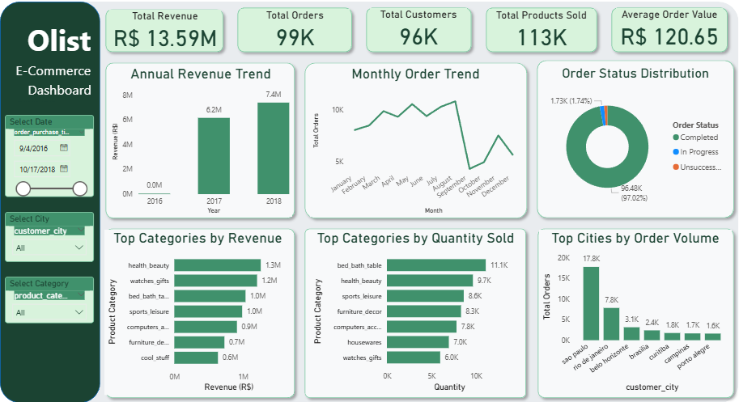

# 🛒 Olist E-Commerce Analysis: End-to-End Data Pipeline

> Transforming 100,000+ e-commerce orders into actionable business insights using SQL and Power BI.

---

## 📌 Project Overview

This project analyzes transactional data from the **Olist marketplace** in Brazil — covering revenue performance, customer behavior, geographic distribution, and operational efficiency.

**Dataset:** [Brazilian E-Commerce Public Dataset by Olist](https://www.kaggle.com/datasets/olistbr/brazilian-ecommerce) — Kaggle  
**Status:** ✅ Completed

---

## 🛠️ Tech Stack

| Tool | Purpose |
|------|---------|
| MySQL | Data extraction & transformation |
| Power BI | Dashboard & visualization |
| SQL | Querying & analysis |
| DAX | KPI calculations |

**Workflow:** ETL → Data Modeling → Analysis → Visualization

---

## ⚙️ Data Workflow

### 1. Data Extraction & Transformation (MySQL)
- Joined multiple datasets: Orders, Customers, Products, and Order Items
- Optimized large CSV imports using `LOAD DATA INFILE` to resolve performance bottlenecks

### 2. Data Modeling (Power BI)
- Built a **Star Schema** to support cross-table relationships
- Calculated key metrics: **Year-over-Year (YoY) Growth**, **Average Order Value (AOV)**

---

## 📈 Key Insights

| Metric | Finding |
|--------|---------|
| 📊 Revenue Growth | **19.35% YoY increase** (2017 → 2018) |
| 💰 Top Revenue Category | **Health & Beauty** |
| 📦 Top Volume Category | **Bed, Bath & Table** |
| 📍 Top Geography | **São Paulo** (~15% of total orders) |
| 👤 Customer Behavior | 96K customers vs 99K orders → **low repeat purchase rate** |

---

## ⚡ Challenges & Solutions

**Challenge:** Large CSV imports caused significant performance degradation  
**Solution:** Used optimized SQL loading techniques (`LOAD DATA INFILE`) to speed up ingestion

**Challenge:** Raw tables had no pre-built relationships  
**Solution:** Manually built a star schema in Power BI to ensure accurate cross-visual filtering

---

## 💡 Business Recommendations

- 🔁 **Improve retention** — Introduce loyalty programs and targeted email campaigns
- 📍 **Focus geographically** — Prioritize marketing in São Paulo and Rio de Janeiro
- 💄 **Double down on Health & Beauty** — Highest revenue-generating category
- 🗓️ **Plan for peak seasons** — Optimize inventory and campaigns ahead of **November / Black Friday**

---

## 📊 Dashboard Preview

> 

---

## 🗂️ Repository Structure

​```
olist-ecommerce-analysis/
│
├── olist_analysis.sql    # SQL queries for data extraction & analysis
├── o3.png                # Power BI dashboard preview
└── README.md
​```

---

## 🚀 Key Takeaway

This project demonstrates a complete data analyst workflow:  
**Raw Data → SQL Analysis → Data Modeling → Interactive Dashboard → Business Insights**

---

## 📫 Connect With Me

- 💼 [LinkedIn](https://www.linkedin.com/in/victoria-okafor-4720a02b8?utm_source=share_via&utm_content=profile&utm_medium=member_android)
- 🐙 [GitHub](https://github.com/vicokafor)
- 📢 *Open to Work*
